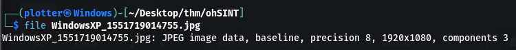
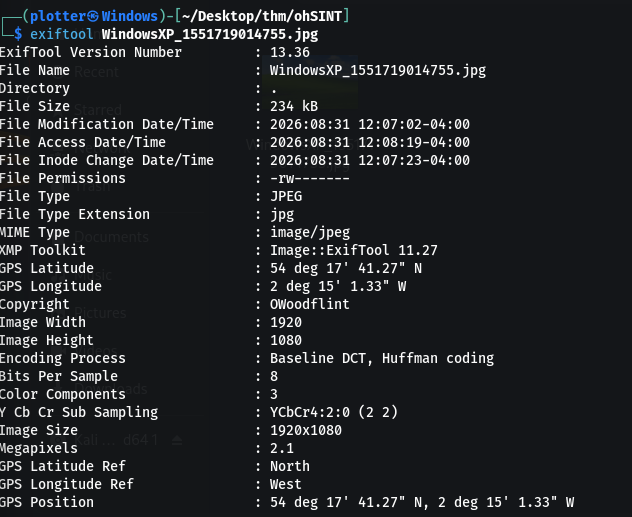
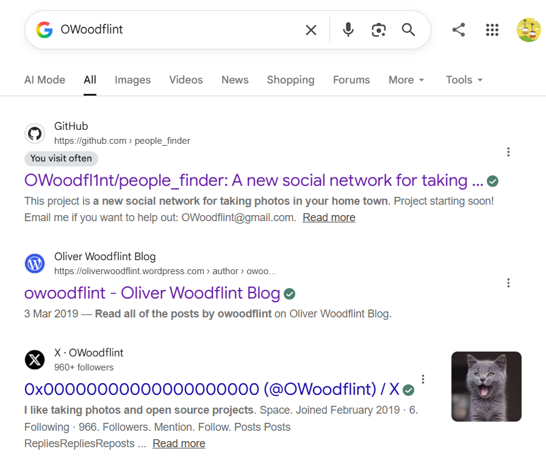
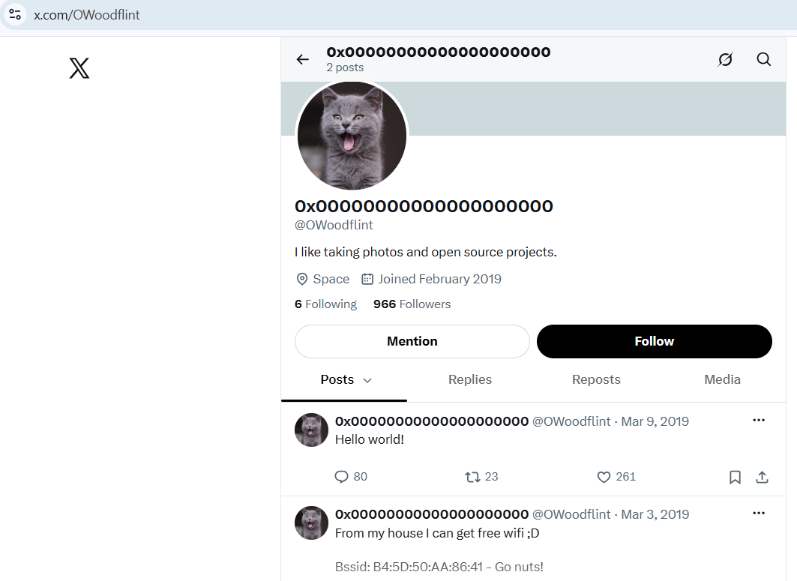
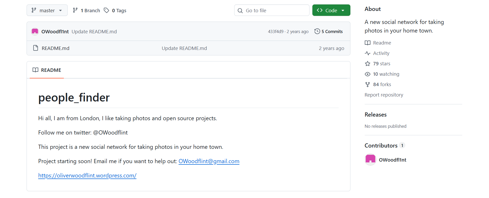
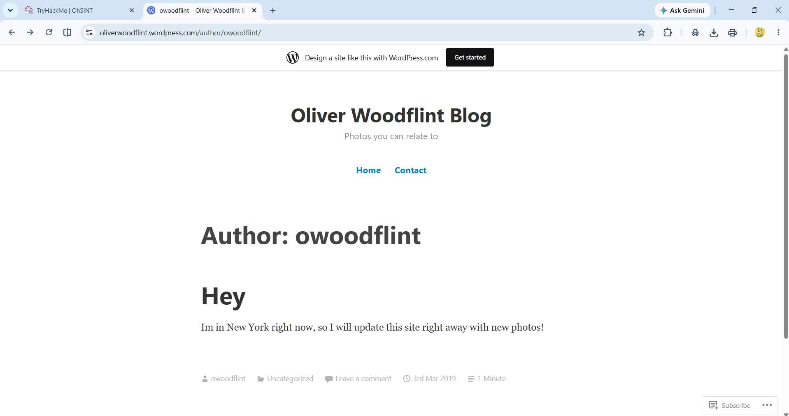
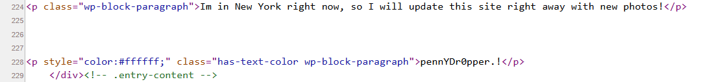

# OSINT Challenge — Information Gathering

## Challenge Description

> What information can you possibly get with just one image file?

Hey!! I am doing an OSINT Challenge to apply my knowledge about information gathering.  
LETS DO IT !!!

---

## Step 1 — Identifying the Image

So they provided a file, on opening that file, which turned out to be a JPG image file, I found it was the old WindowsXP famous wallpaper of the landscape.

I uploaded the JPG image on Bing search, and got the results of Famous WindowsXP Bliss Wallpaper.

Got the name of the wallpaper, but nothing interesting.

Hence I checked the file type.

and turned out the file was indeed JPG file.

---

## Step 2 — Checking the Image Metadata

Then I checked the image's metadata

here we found an interesting thing !!! Hmmm...

I found that....

1. The image had a Copyright to OWoodflint.
2. The image file was processed, edited, or had its metadata written using a software library called ExifTool, specifically version 11.27.
3. There was GPS Latitude Ref, Longitude Red and Position present in the metadata.

Now we are getting somewhere...

---

## Step 3 — Searching for the Username

Since I found a user name, I searched for OWoodflint in browser.

Hmm... we find a github page, a blog page and X account with username as OWoodflint.

---

## Step 4 — Finding the BSSID

On visiting X page we find the user's Bssid.

A little bit of Knowledge:

- A BSSID (Basic Service Set Identifier) is the unique physical MAC address of a specific wireless router or access point radio.
- A SSID is the human-readable name of the Wi-Fi network that appears on your phone or computer.

So we can find out OWoodflint's SSID.

To do that we can you WiGLE, where I put the earlier found Latitute and Longitute points and The BSSID found in X, then BOOM !!!! we found the required SSID.

---

## Step 5 — Checking the GitHub Page

His github page was as shown below:

---

## Step 6 — Finding the Holiday Location

On visiting Oliver Woodflint Blog we find that he is in New York for holidays.

---

## Step 7 — Finding the Password

I viewed the source code of the blog page and found something which seemed like a password.

We were not able to view the password in the page because the text colour was set to white, which blened within the background.

---

# Answering the THM Questions

1. **What is this user's avatar of?**  
   Answer: cat

2. **What city is this person in?**  
   Answer: London

3. **What is the SSID of the WAP he connected to?**  
   Answer: UnileverWiFi

4. **What is his personal email address?**  
   Answer: OWoodflint@gmail.com

5. **What site did you find his email address on?**  
   Answer: Github

6. **Where has he gone on holiday?**  
   Answer: New York

7. **What is the person's password?**  
   Answer: pennYDr0pper.!
